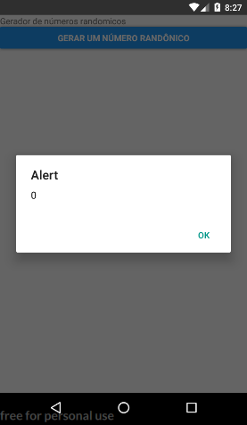
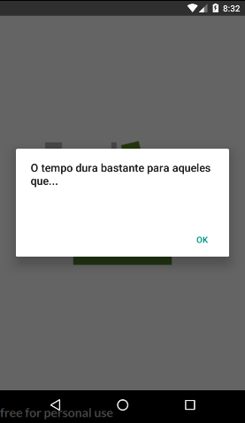
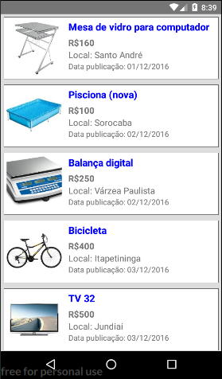
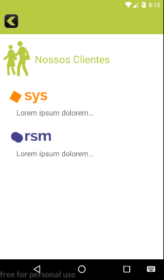
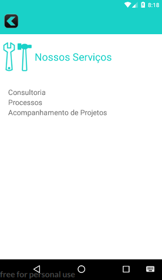

# Curso de React Native realizado na Udemy
**Link:** <https://www.udemy.com/desenvolvedor-multiplataforma-androidios-com-react-e-redux/>

## Apps criados durante o curso

### Gerador de números aleatórios

Primeiro App do curso.
Inicia mostrando a criação de um projeto e traz uma introdução ao JSX e ao ES6

### Frases do dia

Segundo App do curso.
Traz o conceito de altura, largura e densidade nas telas dos dispositivos, mostra a utilização do flexbox, e aplica estilos aos componentes do app.

### Jokenpo

Terceiro App do curso.
Um pequeno jogo que traz a introdução a components, uma etilização mais detalhada e mostar bem a utilização de props e state.

### Catálogo de Produtos

Quarto App do curso.
Nesse app tempos a experiência de fazer requisições HTTP, e fazer a listagem dinâmica do conteúdo com base na requisição. Também temos a explicação do ciclo de vida de um componente e a utilização do Remote debugging

### ATM Consultoria

Quinto App do curso.
Nesse app tempos a oportunidade de trabalhar com a navegação entre cenas. Embora utilizamos o componente Navegate do React, que está depreciado (até o momento o curso n apresentou uma alternativa), a criação do app foi bastante produtiva pois envolveu diversos conceitos explicados em aulas anteriores. Nesse momento é esperado que o aluno já consiga ir aplicando os conhecimentos de forma mais automática.
