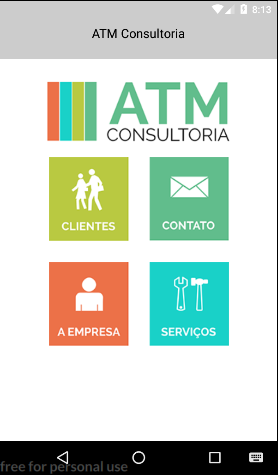
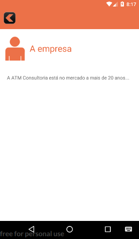

# Curso de React Native realizado na Udemy
**Link:** <https://www.udemy.com/desenvolvedor-multiplataforma-androidios-com-react-e-redux/>

## Apps criados durante o curso

### [Gerador de números aleatórios](criando_meu_primeiro_app_com_react_native)

Primeiro App do curso. 
Inicia mostrando a criação de um projeto e traz uma introdução ao JSX e ao ES6

---

### [Frases do dia](renderizando_elementos)

Segundo App do curso. 
Traz o conceito de altura, largura e densidade nas telas dos dispositivos, mostra a utilização do flexbox, e aplica estilos aos componentes do app.

---

### [Jokenpo](joquempo)

Terceiro App do curso. 
Um pequeno jogo que traz a introdução a components, uma etilização mais detalhada e mostar bem a utilização de props e state.

---

### [Catálogo de Produtos](catalogo_de_produtos)

Quarto App do curso. 
Nesse app tempos a experiência de fazer requisições HTTP, e fazer a listagem dinâmica do conteúdo com base na requisição. Também temos a explicação do ciclo de vida de um componente e a utilização do Remote debugging.

---

### [ATM Consultoria](atm_consultoria)

Quinto App do curso. 
Nesse app tempos a oportunidade de trabalhar com a navegação entre cenas. Embora utilizamos o componente Navegate do React, que está depreciado, a criação do app foi bastante produtiva pois envolveu diversos conceitos explicados em aulas anteriores. Nesse momento é esperado que o aluno já consiga ir aplicando os conhecimentos de forma mais automática.

---

### [Cara ou Coroa](cara_ou_coroa)

Sexto App do curso. 
Nesse app nos é apresentado o React Native Router Flux e algumas funcionalidades dele, como: trocar de cena e colocar título. Foi de grande proveito, pois se tornou uma ótima alternativa ao Navegate.

---

### [Calculadora](calculadora)

Sétimo App do curso. 
Nesse app temos a experiência de controlar estados de componentes a partir de ação em outros componentes. 
Foram criados diversos componentes pais e filhos no qual foi necesário passar métodos e dados por props, de forma que o componente pai App pudesse gerenciar os estados de toda a aplicação.

### [firebaseTeste](firebaseTeste)

Esse App foi desenvolvido para termos algumas base do firebase como cadastrar usuario, fazer login e logout, verificar login e fazer um crud no banco de dados.
